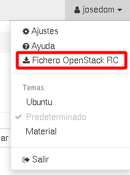

# Instalación y uso básico de OpenStack client (OSC)

Otra forma de interactuar con OpenStack es usar un cliente de línea de comandos: *Openstack Client (OSC)*.

## Instalación de OpenStack Client

Para instalar el cliente de OpenStack podemos usar un entorno virtual de python3:

```
$ python3 -m venv os
(os)$ source os/bin/activate
(os)$ pip install python-openstackclient
```

```
(os)$ openstack --version
openstack 7.2.1
```

O realizar la instalación con `apt`:

```
apt install python3-openstackclient
```

```
openstack --version
openstack 6.0.0
```

Ahora necesitamos el fichero de credenciales, para que nos podamos autentificar a nuestro proyecto de OpenStack, para descargar el fichero desde horizon escogemos la siguiente opción:



Para cargar las variables de entorno que se definen en ese fichero podemos ejecutar:

```
(os)$ source Proyecto\ de\ josedom-openrc.sh
Please enter your OpenStack Password for project Proyecto de josedom as user josedom: 
```

Y nos pide la contraseña de nuestro usuario que se guardará en otra variable de entorno. Una vez introducida la contraseña podremos usar el comando `openstack` para gestionar los recursos de nuestro proyecto. Por ejemplo para ver las máquinas que tenemos creadas ejecutamos:

```
(os)$ openstack server list
```

## Configuración de las claves ssh con OSC

Para crear una clave ssh con el cliente de Openstack, podemos ejecutar:

```
(os)$ openstack keypair create --public-key ~/.ssh/id_rsa.pub miclave
```

Puedo ver las claves que tengo creadas en mi proyecto, ejecutando:

```
(os)$ openstack keypair list
```

Para aprender más operaciones que podemos realizar con las claves con OSC: [OpenStackClient keypair](https://docs.openstack.org/python-openstackclient/latest/cli/command-objects/keypair.html).

## Configuración de los Grupos de seguridad con OSC

Con el cliente de OpenStack también podemos hacer la gestión completas de los grupos de seguridad: crear nuevos grupos, crear nuevas reglas, ... Por ejemplo para abrir el puerto 22 y poder acceder a las instancias por SSH, podemos ejecutar:

```
(os)$ openstack security group rule create --protocol tcp --remote-ip 0.0.0.0/0 --dst-port 80 default
```

Para permitir el protocolo ICMP y poder hacer ping a las instancias, ejecutaríamos:

```
(os)$ openstack security group rule create --protocol icmp  default
```

Por último, para ver las reglas del grupo de seguridad **default**:

```
(os)$ openstack security group rule list default
```

Para estudiar todas las opciones disponibles para trabajar con los grupos de seguridad: [OpensStackClient security group](https://docs.openstack.org/python-openstackclient/latest/cli/command-objects/security-group.html) y [OpenStackClient security group rule](https://docs.openstack.org/python-openstackclient/latest/cli/command-objects/security-group-rule.html).
