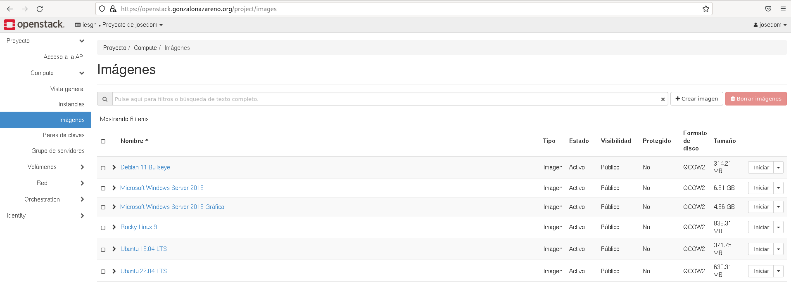
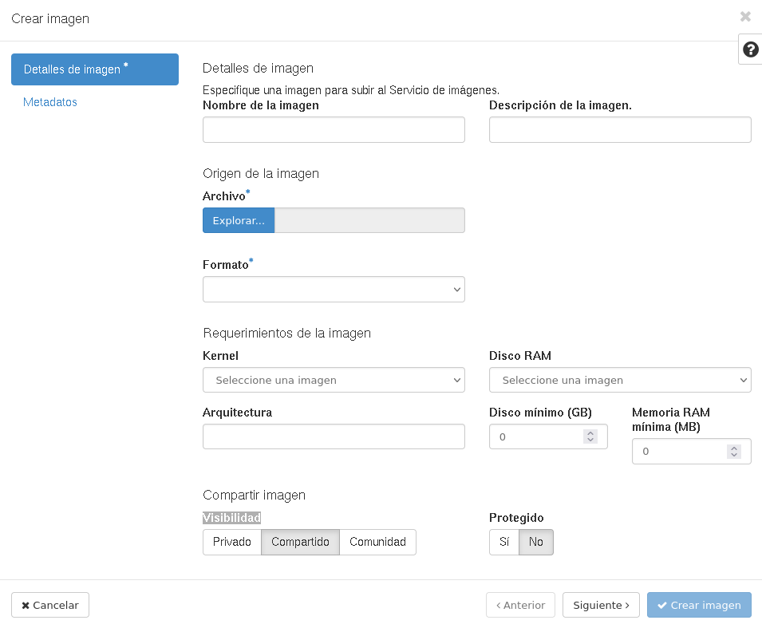

# Gestión imágenes con Horizon

Una imagen de máquina virtual, o de forma abreviada una imagen, es un fichero que contiene un disco virtual con un sistema operativo con la configuración conocidos los relacionados con los hipervisores más conocidos: VMDK para VMware, qcow2 para QEMU/KVM, etc. o el formato (ami-ari-aki propio de Xen y muy habitual en IaaS por ser el que utiliza Amazon EC2).

Teniendo en cuenta el enfoque de recursos compartidos que se utiliza en IaaS, es muy frecuente que se compartan entre todos los usuarios un conjunto de imágenes genéricas con los sistemas operativos más habituales, es lo que se conoce como **imágenes públicas**. También es posible que el usuario suba o gestione sus propias imágenes, con el grado de configuración que desee.

Las imágenes se utilizan para instanciar las máquinas virtuales que realmente utiliza el usuario.

## Catálogo de imágenes

Para ver las imágenes que inicialmente podemos utilizar abrimos la opción de **Imágenes**:

Una imagen se puede **lanzar** para crear una instancia a partir de ella. También podemos **Crear un volumen** a parir de una imagen. Las imágenes también pueden ser **borraradas**.

### Subir una imagen

Podemos subir nuestras propias imágenes a través de las opcion  **Crear imágen**:

Indicamos los siguientes datos:
	
* **Nombre**: Nombre que asignaremos a la nueva imagen.
* **Descripción**: Texto que describa la nueva imagen que vamos a subir.
* **Origen de la imagen**: Indicamos desde donde vamos a subir la imagen:
* **Formato**: Seleccionamos el formato de la imagen. Los formatos
  soportados son : 
  * qcow2 : Soportado por el emulador QEMU que puede expandirse de forma
    dinámica.
  * raw : Un formato de imagen de disco desestructurado, si se tiene un
    fichero sin extensión entonces probablemente se trate de un formato raw. 
  * iso : Un formato de ficheros para datos contenidos en un disco óptico,
    como por ejemplo un CD-ROM.
  * vmdk : Formato de disco común, soportado por muchos hipervisores, en particular VMware.
  * aki : Una imagen kernel de Amazon EC2.
  * ari: Una imagen de disco en RAM de Amazon EC2.
  * ami : Una imagen de máquina Amazon, que precisa de una imagen aki y
    habitualmente de otra ari para poder arrancar.
* **Arquitectura**: Indicamos la arquitectura del sistema operativo de la imagen.
* **Disco mínimo (GB)**: Requisito que nos indica el tamaño mínimo que tiene que debe tener una instancia que se cree a partir de la imagen.
* **RAM mínima (MB)**: Requisito que nos indica el tamaño mínimo de memoria RAM que debe tener una instancia que se cree a partir de la imagen.
* **Visibilidad**: Un usuario que no es administrador, no puede subir imágenes públicas. La imagen sólo sería visible para el usuario. tenemos varias [niveles de visibilidad](https://wiki.openstack.org/wiki/Glance-v2-community-image-visibility-design).
* **Protegido**: La imagen que vamos a crear no se podrá borrar por otro usuario.
