# Creación de instancias a partir de una imagen

El objetivo de esta sección es mostrar es la creación de una instancia GNU/Linux
a partir de una de las imágenes disponibles. Para ello accedemos al apartado
**Instancias** > **Lanzar instancia** y a continuación tenemos
que indicar los siguientes datos:

### Detalles 

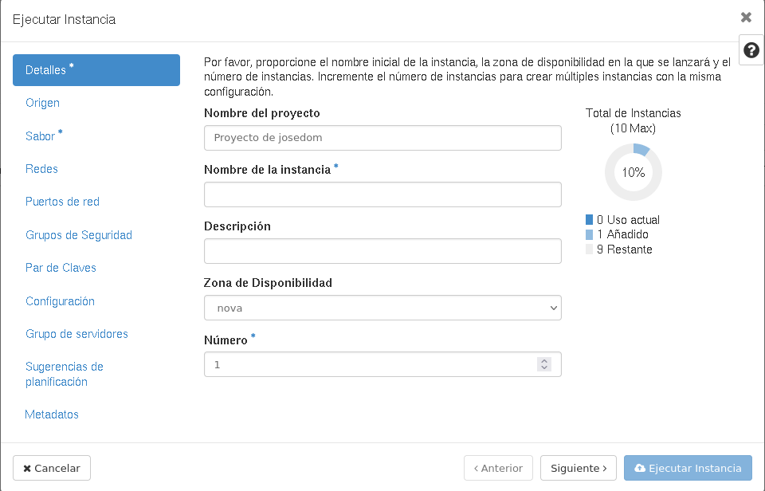

Indicamos el **nombre de la instancia**, la **descripción**, la zona de disponibilidad (en nuestro caso *nova*) y el número de instancias que se van a crear.

### Origen

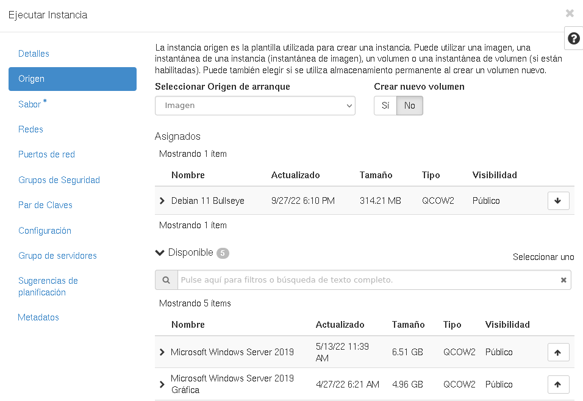

Seleccionamos el origen que vamos a usar para crear la instancia. Tenemos cuatro posibilidades:

* **Imagen**: Es la que vamos a escoger en este apartado. Elegimos de la lista la imagen que vamos a usar.
* **Instantánea de instancia.**
* **Instantánea de volumen.**
* **Volumen**

En las dos primeras opciones no da la posibilidad de **crear un nuevo volumen** (lo estudiaremos en el módulo de almacenamiento). En las dos últimas posibilidades nos da la opción de **eliminar el volumen** al eliminar la instancia.

## Sabor

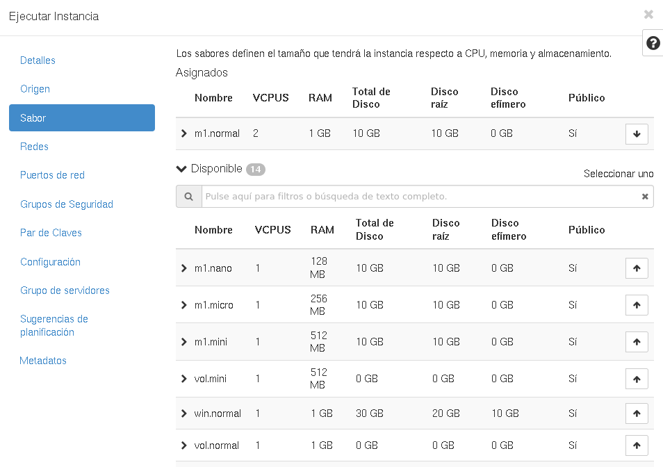

Se escoge el sabor de la instancia que vamos a crear. El sabor determina las características de VCPUS, memoria RAM y tamaño de disco que tendrá la instancia. Cada instancia nos determina 4 valores:

* Número de **VCPUS**.
* Tamaño de la memoria **RAM**.
* Tamaño del **disco raíz** principal.
* Tamaño de un segundo disco que llama **disco efímero**.

En el instituto tenemos tres tipos de sabores:

* **m1**: Son sabores pensadas para las máquinas Linux sin entorno gráfico.
* **vol**: Son sabores que se deben usar al crear instancias sobre volúmenes, en este caso los tamaños de discos están a 0, porque serán del tamaño que creemos el volumen.
* **win**: Son sabores pensadas para las máquinas Windows.

### Redes

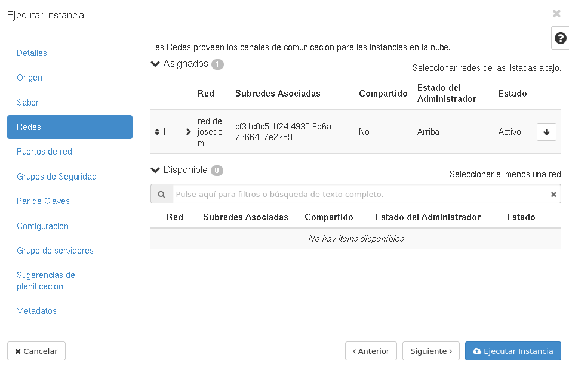 

En este apartado escogemos las redes definidas en el proyecto donde estará conectada la instancia. Si sólo tenemos una se escoge por defecto.

### Puertos de red

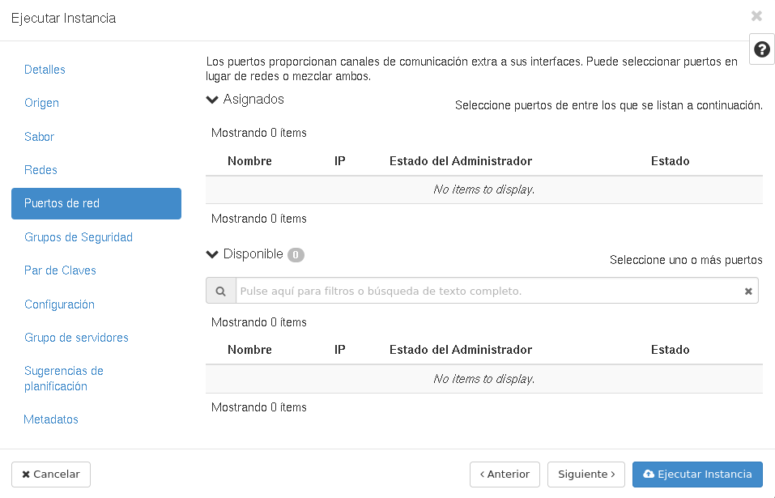 

Si hemos creado algún puerto (lo estudiaremos en el módulo de redes) podrémos escogerlos para especificar la configuración de red de la instancia.

### Grupos de Seguridad

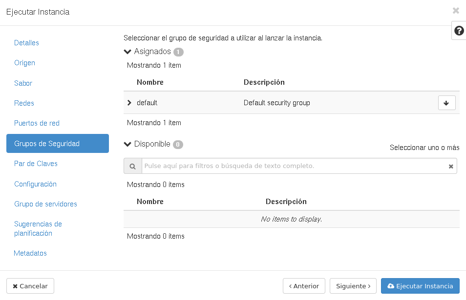 

Se escoge los grupos de seguridad que van a configurar el cortafuego de la instancia. Si sólo tenemos uno definido, se escogerá por defecto.

### Par de claves

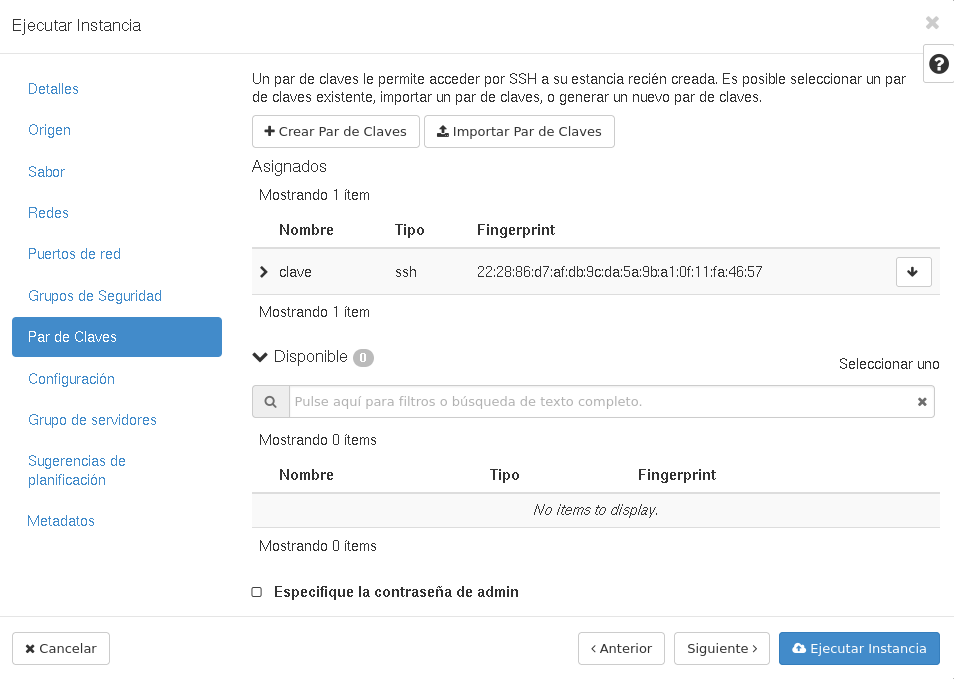 

Seleccionamos la clave pública que hemos subido a OpenStack para que se inyecte a la instancia y nos permita el acceso. Si sólo tenemos definida una clave, se escogerá por defecto.

### Configuración

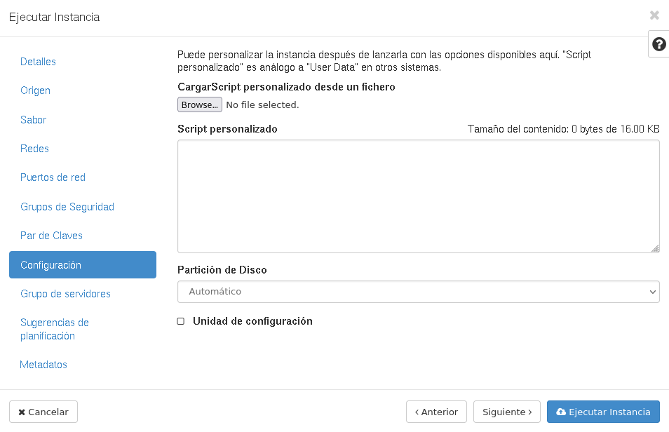 

En este apartado podemos introducir un script para configurar de forma automática la instancia por medio de **cloud-init**. Lo estudiaremos en un apartado posterior.

### Opciones restantes

Las opciones restante nos la vamos a estudiar en este curso.

## Asignación de IP flotante

Una vez que hemos creado la instancia:

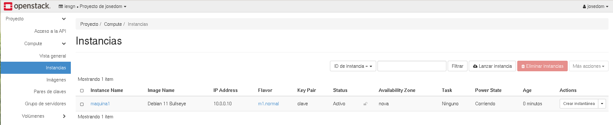 

Comprobamos que tiene asignada una IP en el direccionamiento privado que posee la red privada a la que hemos conectado la instancia. Necesitamos un mecanismo que nos permita, utilizando una IP en el mismo rango que nuestra red de trabajo, el acceso a la máquina. A esta tipo de dirección IP la llamamos **IP flotante** y por medio de un mecanismos de DNAT que se produce el router donde está conectada la red privada, permite el acceso a la instancia.

Para asignar una **IP flotante** a la instancia:

1. Elegimos la opción **IPs flotantes** en el apartado **Red** y reservamos una nueva IP, con la opción **Asignar IP al proyecto**.

	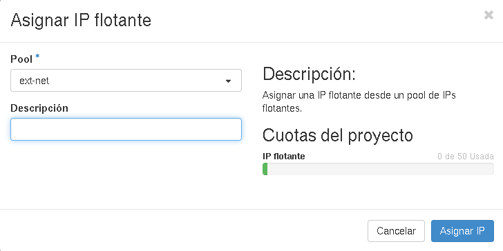 

2. A continuación podemos elegir la opción **Asociar** de la IP flotante que hemos reservado, y asignamos esa nueva IP a la instancia que acabamos de crear.

	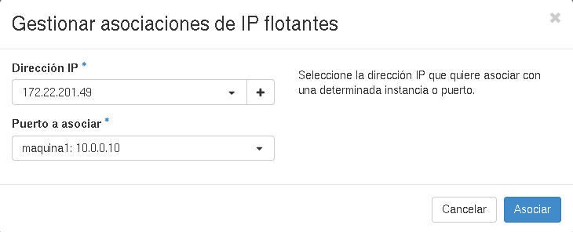 

3. Recuerda que una vez que la IP pública no esté asignada a una instancia se puede liberar.
4. También podemos gestionar las IPs flotantes asignadas a una instancia desde el menú **Asociar IP flotante** de las acciones que podemos realizar a una instancia.
5. Ahora podemos acceder a la instancia usando la IP flontante y nuestra clave privada.

	```
	ssh debian@172.22.201.49
	The authenticity of host '172.22.201.49 (172.22.201.49)' can't be established.
	ECDSA key fingerprint is SHA256:92GUIaJtO12FgZDkidfzTSyciQqi5gSl4oFJDttBdmI.
	Are you sure you want to continue connecting (yes/no/[fingerprint])? yes
	Warning: Permanently added '172.22.201.49' (ECDSA) to the list of known hosts.
	Linux maquina1 5.10.0-18-amd64 #1 SMP Debian 5.10.140-1 (2022-09-02) x86_64
	
	The programs included with the Debian GNU/Linux system are free software;
	the exact distribution terms for each program are described in the
	individual files in /usr/share/doc/*/copyright.
	
	Debian GNU/Linux comes with ABSOLUTELY NO WARRANTY, to the extent
	permitted by applicable law.
	debian@maquina1:~$ 
	```

	Si el fichero de la clave privada no se llama `id_rsa`, tendremos que usar la opción `-i` para realizar la conexión: `ssh -i clave debian@172.22.201.49`.
	
