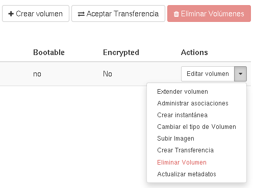
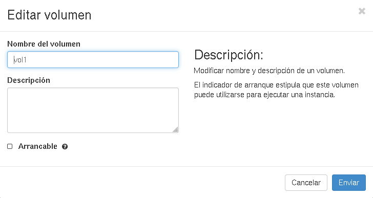
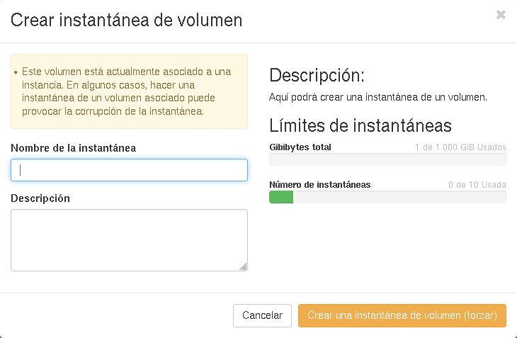
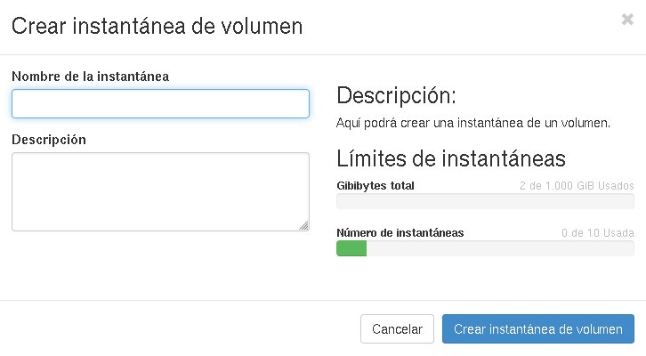
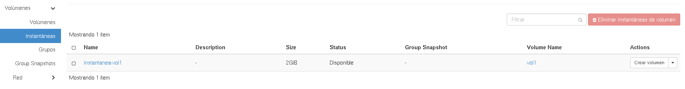
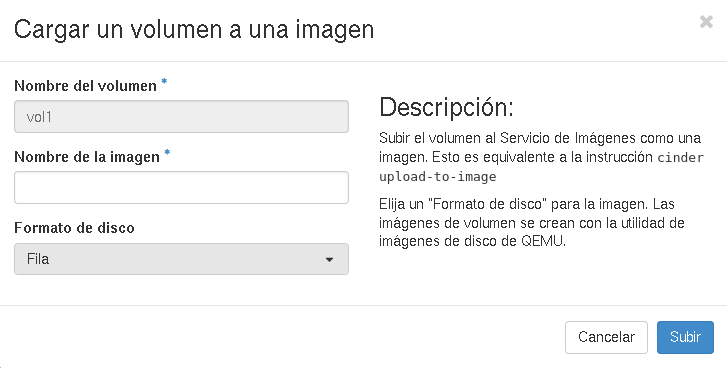
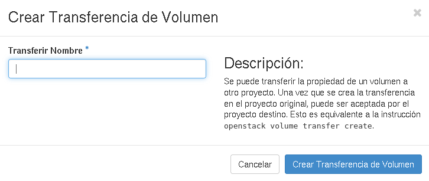

# Operaciones sobre volúmenes

## Editar el volumen

Esta opción nos permite cambiar el nombre y la descripción del volumen. Además, si contiene el contenido de una imagen podemos indicar que el disco va  a ser arrancable.

## Extender volumen

Podemos redimensionar el dispositivo de bloque (el volumen). 
Veamos un ejemplo:

1. Hemos creado un volumen de 1Gb de tamaño lo hemos asociado a una instancia y lo vamos a formatear:

		$ sudo mkfs.ext4 /dev/vdb
		$ sudo mount /dev/vdb /mnt

	Y comprobamos el tamaño de nuestro dispositivo de bloque:

		$ df -h
		...
		/dev/vdb               1007.9M     33.3M    923.4M   3% /mnt

2. Vamos a redimensionar a un tamaño de 2Gb:

	

	A continuación tenemos que redimensionar el sistema de ficheros:

		$ sudo e2fsck -f /dev/vdb
		$ sudo resize2fs /dev/vdb
		$ sudo mount /dev/vdb /mnt

	Y volvemos a comprobar el tamaño del disco:

		$ df -h
		...
		/dev/vdb                  2.0G     67.0M      1.8G   4% /mnt

## Crear instantánea

Al crear una instantánea (snapshot) estoy guardando el contenido del volumen. A partir de una instantánea se pueden crear nuevos volúmenes con el mismo contenido que el original.
Veamos un ejemplo:

1. Tenemos asociado un volumen formateado y montado en una instancia. Vamos a crear un fichero de prueba:

		$ cd /mnt/
		$ sudo touch prueba.txt

2. A continuación vamos a crear una instantánea del volumen. Si el volumen está asociado a una instancia, te advierte que puede haber corrupción de datos:

	

	Por lo tanto desasociamos el volumen y volvemos a crear la instantánea:

	

3. En la pestaña **Instátaneas de volumen** encontramos las instantáneas que hemos creado:

	

	Con la opción **Crear volumen** podemos crear un volumen a partir de la instantánea:

	

4. Si asociamos este nuevo volumen a la instancia, y lo montamos, podemos comprobar que el fichero de prueba está creado:

		$ sudo mount /dev/vdc /mnt
		$ cd /mnt/
		$ ls
		lost+found  prueba.txt

## Cambiar el tipo de volumen

Si tenemos a nuestra disposición varios tipos de Volumen (distintos backends donde podemos crear volúmenes) con esta operación podemos hacer la migración de un tipo de volumen a otro.

## Subir Imagen

Esta operación nos permite subir el contenido de un volumen como una imagen en Glance. Muy adecuada cuando el volumen contiene un sistema operativo y lo queremos guardar como imagen. Hay que indicar el tipo de fichero que queremos crear.

## Crear transferencia

Esta opción nos permite transferir un volumen de un proyecto a otro. Para ello el volumen no debe estar asociado a una instancia.

## Eliminar volumen

Nos permite eliminar un volumen. Un volumen no se puede eliminar si está asociado a una instancia, o se creado una instantánea a partir de él.
