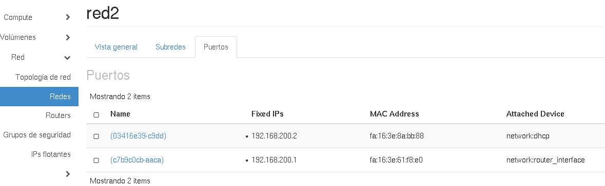
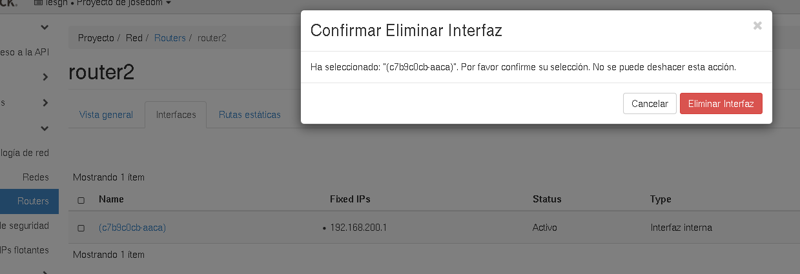
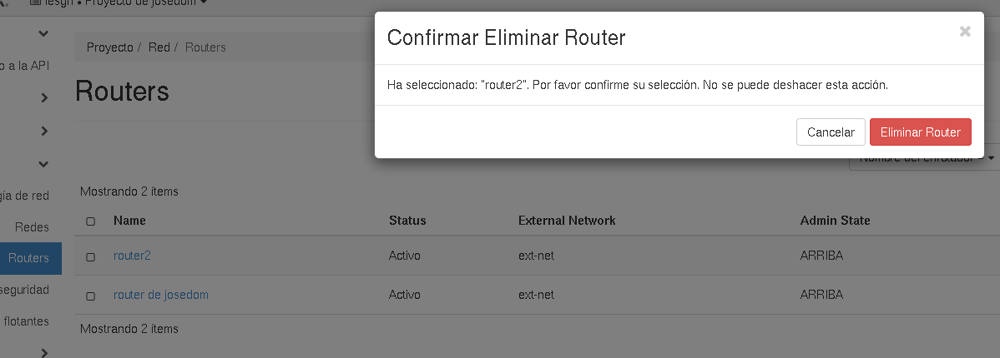
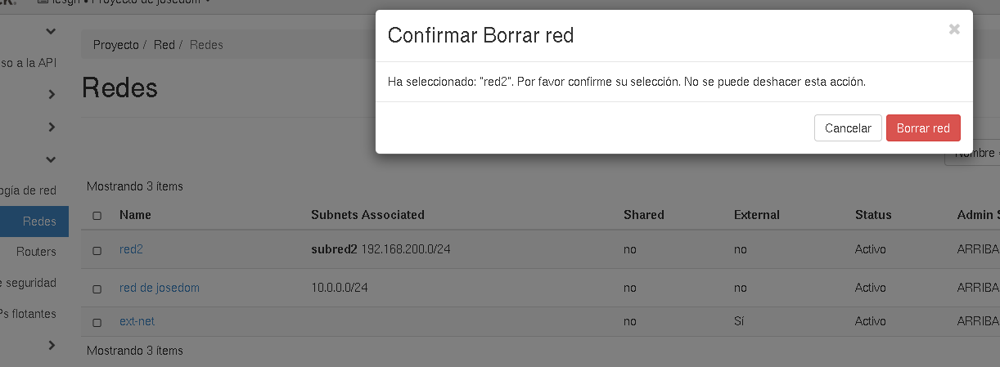

# Eliminación de la infraestructura de red creada

Si queremos eliminar la red, subred asociada y router que hemos creado en el ejercicio anterior, tenemos que tener en cuenta el siguiente orden:

1. Evidentemente no puede existir ninguna instancia que este conectada a la red que queremos eliminar. Por lo tanto terminamos todas las instancias y comprobamos en la lista de puerto que no hay ninguna interfaz conectada a una instancia (dispositivo **nova:compute**).

	

2. A continuación tenemos que asegurarnos de desconectar la red al router. Mientras exista la interfaz en el router conectada a la red, no se podrán eliminar ni la red ni el router. Para desconectar la red del router, elegimos la opción **Eliminar interfaz** en el router que deseamos eliminar.

	

3. Por últimos podemos borrar la red y el router que habíamos creado.

	

	
