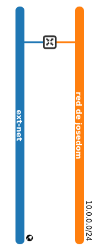
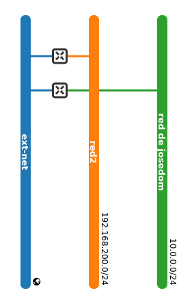
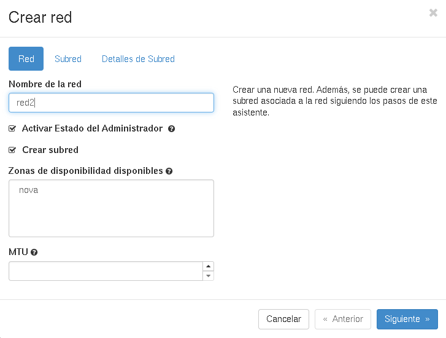
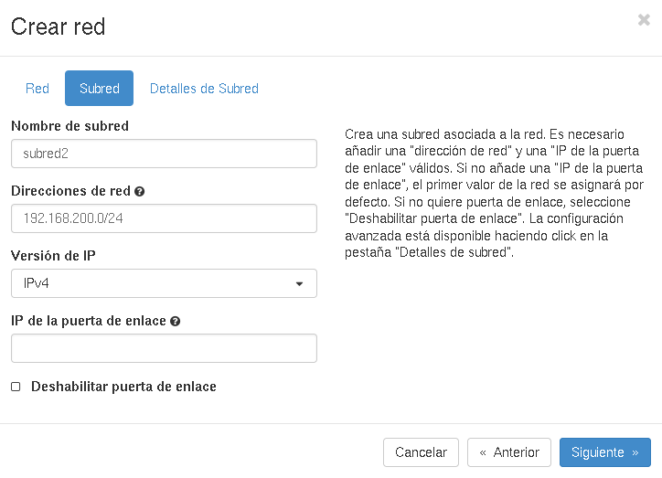
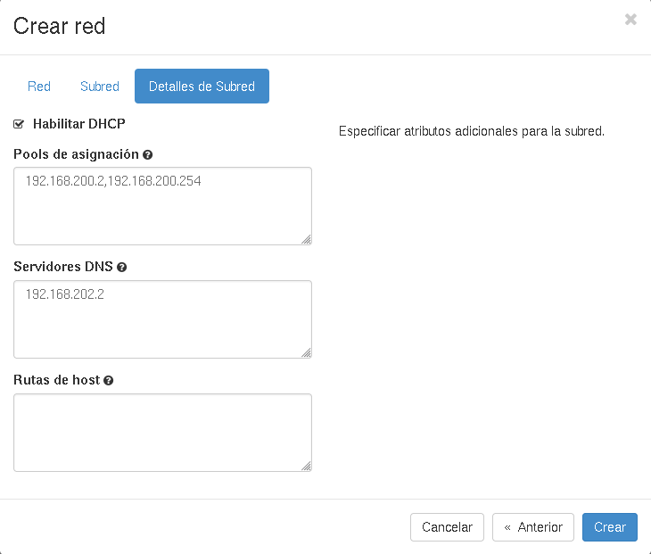
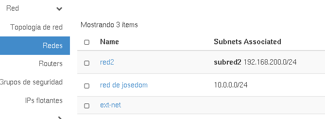
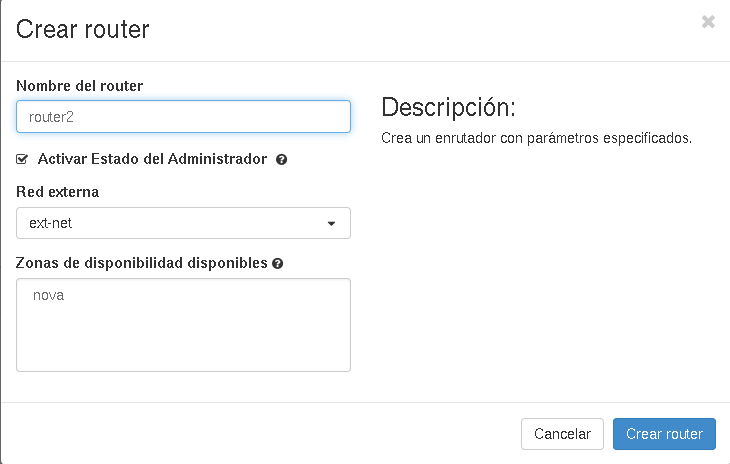
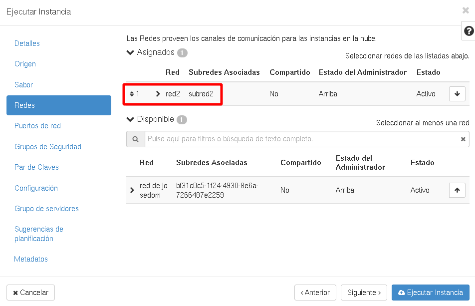
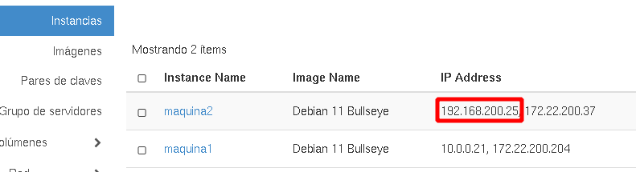
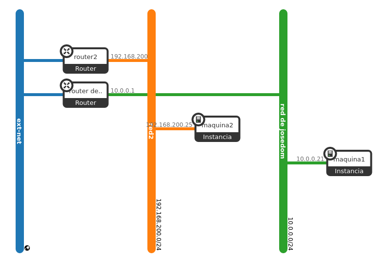

# Gestión de redes con horizon

Partimos del siguiente esquema de red con el que hemos estado trabajando. Puedes acceder a este esquema en el menú **Red** -> **Topología de red**:

En esta demostración vamos a crear una nueva red, una nueva subred y un nuevo router. El router estará conectado a la red externa y a la nueva red creada. El esquema de red sería el siguiente:

1. En el apartado **Redes** vamos a crear una nueva red.

	

	Los datos que vamos a introducir son los siguientes:

	* **Nombre de la red**
	* **Estado de administración**: Podemos indicar si la red va a esta habilitada (up/arriba) o deshabilitada (down/abajo).
	* **Crear subred**: Indicamos si vamos a crear una subred asociada.

	A continuación indicamos los datos de la subred asociada:

	

	* **Nombre de subred**: El usuario deberá indicar un nombre a proporcionarle a la subred.
	* **Direcciones de red**: Se debe introducir un CIDR válido, el cual indicará un bloque de direcciones IPs.
	* **Versión IP**: Se especifica la versión de las direcciones IPs.
	* **IP de la puerta de enlace**: Dirección IP que especificamos para la puerta de enlace. Debe pertenecer a las direcciones del CIDR. Si se especifica este valor tenemos que comprobar que esta dirección no se superpone a alguna dirección del pool de direcciones. Si no se indica, se cogerá la primera dirección del pool de direcciones.
	* **Deshabilitar la puerta de enlace**: Si escogemos esta opción no se enviará gateway a las instancias que se conecten a esta red.

		

	* **Habilitar DHCP**: Con esta opción activamos o desactivamos el servidor DHCP asociado a esta red.
	* **Pool de direcciones**: Indica el rango de direcciones IPs que se utilizarán para asignar IPs a los servidores virtuales. Este rango debe pertenecer a las direcciones del CIDR. 	
	* **Servidores DNS**: El usuario puede especificar una lista de dns. Este campo se introduce separado por comas.
	* **Rutas de hosts**: Son las rutas de encaminamiento que el servidor DHCP va a enviar a las instancias que se conecten a la red.

	Comprobamos que se ha creado la nueva red:

	

2. Creamos un router: Para ello elegimos: **Red**->**Routers**->**Crear router**, escogemos la red externa a la que va a estar conectado nuestro router:

	

	A continuación vamos a conectar la nueva red al router que hemos creado, para ello seleccionamos el router y las opciones **Interfaces**->**Añadir Interfaz**:

	

	En el apartado **Dirección IP (opcional)** podemos indicar la dirección IP que toma esta nueva interfaz, son se especifica se cogerá la primera del pool de direcciones que hemos indicado al configurar la subred.

3. Una vez creado nuestra nueva red, conectada a un nuevo router vamos a crear una instancia en la nueva red (suponemos que en nuestra primera red tenemos creada una instancia) y vamos a comprobar que se le puede asociar una ip flotante, además vamos a comprobar que no podemos hacer ping a otra instancia que está conectada a la otra red.

    A la hora de crear la nueva instancia tenemos que asegurarnos que la conectamos a la nueva red.

    

    Podemos comprobar en la siguiente imagen que la nueva instancia tiene una IP fija en el rango de la nueva red (192.168.200.0/24) y que tiene asociada una IP flotante.

    

    Por último podemos comprobar que las instancias no tienen conectividad. Si accedemos a una de ella, y hacemos ping a la IP fija de la otra, evidentemente, no tendremos conectividad. Evidentemente si podemos acceder de las IP flotantes:		

		$ ssh debian@172.22.200.37
		debian@maquina2:~$ ping 10.0.0.21
		PING 10.0.0.21 (10.0.0.21) 56(84) bytes of data.
		^C
		--- 10.0.0.21 ping statistics ---
		3 packets transmitted, 0 received, 100% packet loss, time 2044ms
		
		debian@maquina2:~$ ping 172.22.200.204
		PING 172.22.200.204 (172.22.200.204) 56(84) bytes of data.
		64 bytes from 172.22.200.204: icmp_seq=1 ttl=62 time=1.28 ms
		64 bytes from 172.22.200.204: icmp_seq=2 ttl=62 time=1.22 ms

El esquema final del escenario que hemos construido sería:

