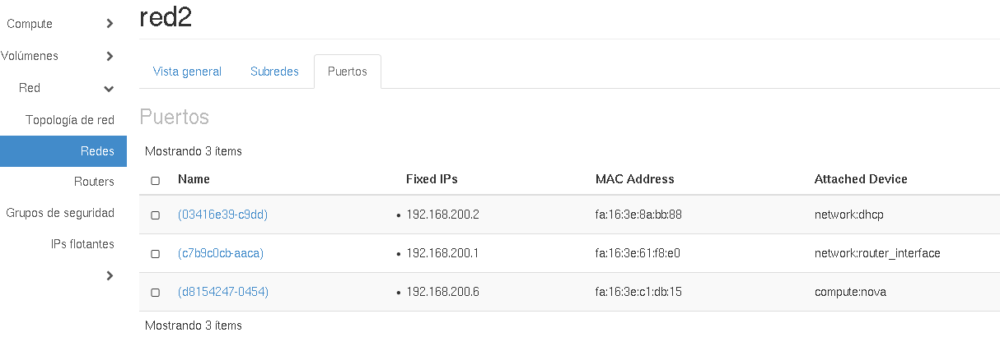
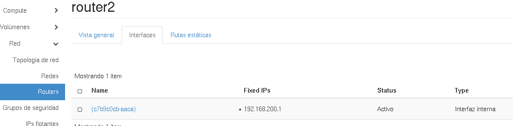
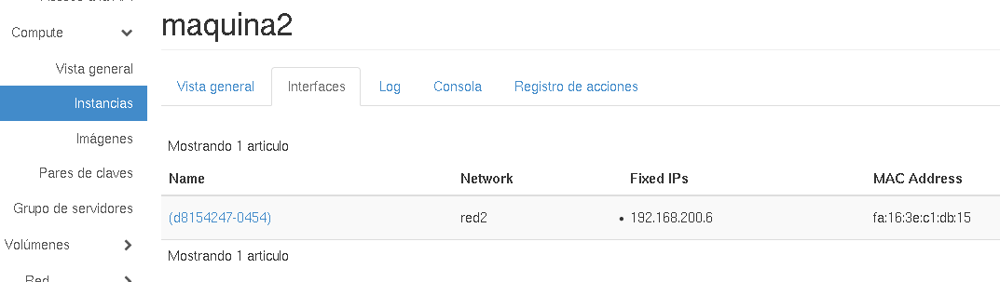
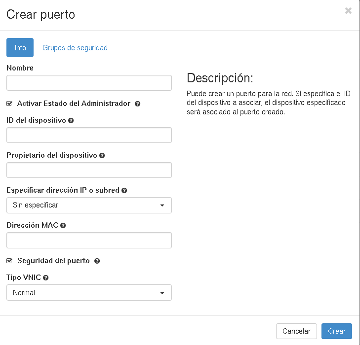
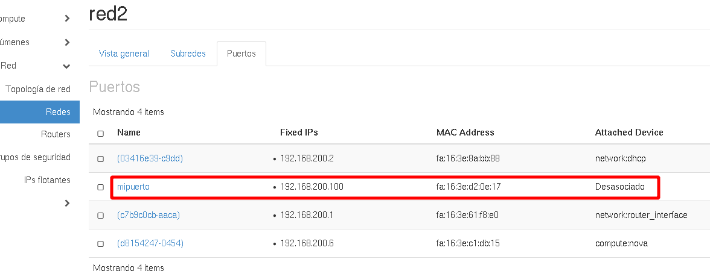
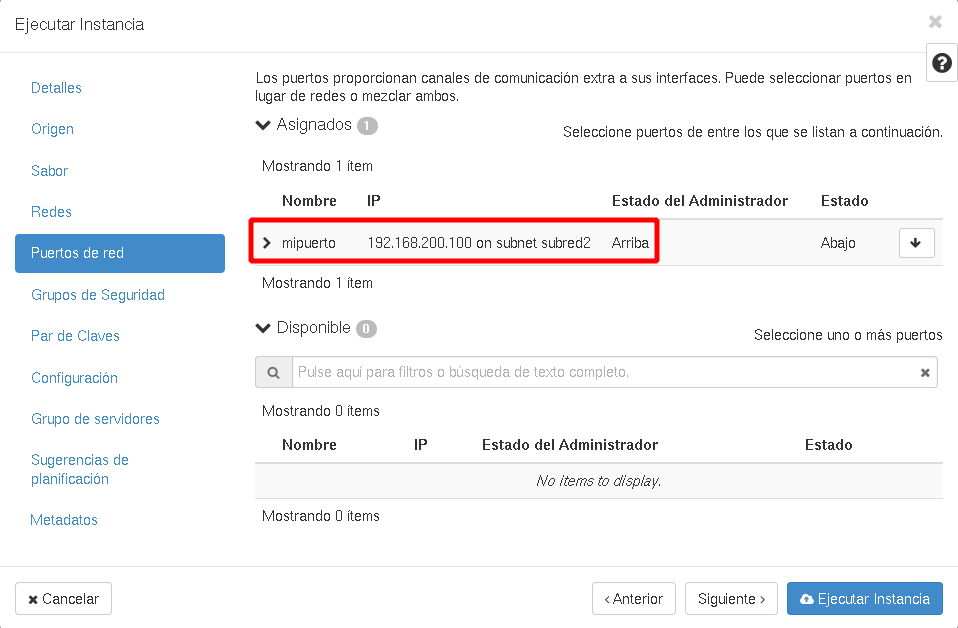
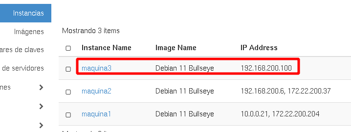
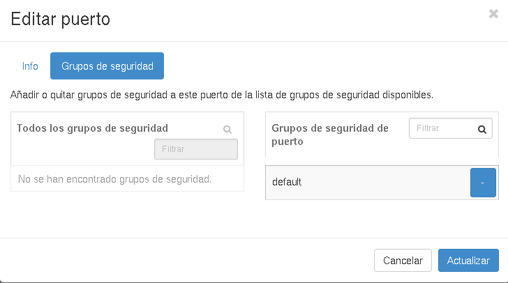
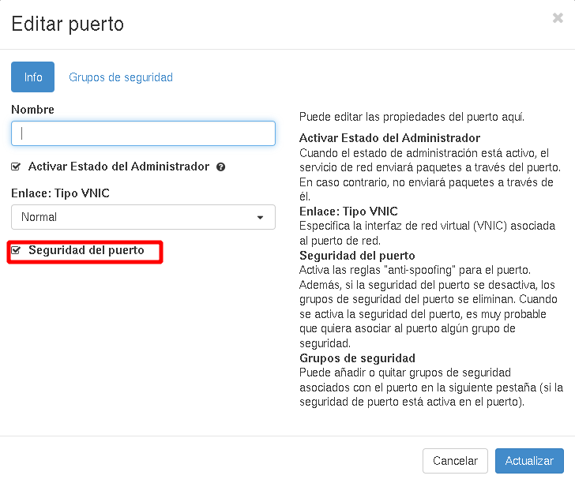

# Puertos de red

Un puerto de red (realmente los puertos están asociados a la subred que hemos definido en la red) lo podemos entender como un puerto virtual de un "switch virtual" que interconecta todos los dispositivos conectados a la red. Para acceder a los puertos de una subred, escogemos la red a la que corresponde y vemos la siguiente pantalla:

Como podemos observar tenemos tres puertos:

* **network:router_interface**: Este puerto corresponde con la interfaz de red conectada al router, y como vimos anteriormente ha tomado la primera dirección del pool de direcciones configurada en el servidor DHCP.
* **compute:nova**: Corresponde al puerto donde se ha conectado la instancia que hemos conectado a la red.
* **network:dhcp**: Corresponde con el puerto donde tenemos conectado el servidor DHCP de la red. Este servidor se crea cuando arrancamos la primera instancia que conectamos a la red, y como puedes observar coge una dirección ip anterior a la que escoge la instancia.

Además podemos ver las conexiones de estos puertos en los distintos dispositivos accediendo al apartado interfaces. Por ejemplo vemos las interfaces del router:

Y las interfaces de la máquina que está conecta a esta red:

## Creación de puertos

Cada vez que conectamos un dispositivo a una red se crea un puerto de red. Otra opción que tenemos es crear un puerto en una subred y configurarlo. Al crearlo, este puerto no estará conectado a ningún dispositivo, pero podremos conectarlo a una instancia o a un router posteriormente.

Elegimos la opción **Crear puerto** en el apartado puertos de una subred:

Los datos más significativos que podemos indicar son:

* Nombre del puerto.
* Especificar la IP, y en este caso lo más interesante sería poner una **IP estática**. Podríamos poner también una IP en un rango de la subred pero se comportaría de manera similar a cuando realiza la conexión directamente a la red.
* Seguridad del puerto: Nos permite habilitar o deshabilitar los grupos de seguridad del puerto, el cortafuego que tiene cada puerto.
* Grupos de seguridad: Nos permite configurar el cortafuegos del puerto.

A continuación, podemos crear una instancia y usar este puerto que hemos creado para su conexión (la estaríamos conectando a la red donde hemos creado el puerto):

Y finalmente comprobamos que se ha creado la instancia con la IP que habíamos configurado en el puerto.

## Deshabilitar la seguridad de un puerto

Como hemos comentando anteriormente OpenStack nos proporciona un cortafuegos por cada interfaz de red que tiene una instancia. Las reglas de este cortafuegos están gestionadas en los **Grupos de Seguridad** y además, tenemos la opción de habilitar o deshabilitar la seguridad de un determinado puerto, es decir activar o desactivar el cortafuegos para cada interfaz.

El cortafuegos que tenemos habilitado en cada interfaz de una instancia, además de controlar los puertos que tienen permitido el acceso por medio de las regalas que declaramos en los **Grupos de Seguridad**, tiene reglas adicionales para evitar ataques de spoofing. Estas reglas que aumentan la seguridad de los puertos provocan que algunos escenarios que montamos en OpenStack no funcionen de manera adecuada, por ejmplo, si queremos que una instancia haga de router.

Por todo ello es posible configurar por separado cada **Grupo de Seguridad** de cada puerto, para ello escogemos **Instancias -> Intefaces -> Editar grupos de seguridad**:

Por otro lado si deseamos desactivar la **Seguridad de un Puerto** escogemos **Instancias -> Intefaces -> Editar puerto** y desmarcamos la opción **Seguridad del puerto**.

